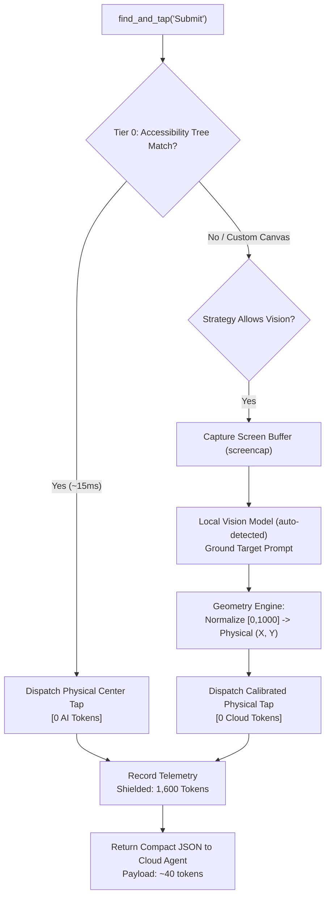

# Peep Architecture Specification

This document details the internal design, perception cascade, coordinate geometry engine, and token shield isolation boundary of **Peep (Peripheral Evaluation & Execution Proxy)**.

---

## 1. System Vision & The Token Shield Boundary

In modern agentic coding workflows, the frontier model powering your harness acts as the **Principal Engineer**. Its primary strengths are high-level software architecture, deep reasoning across codebases, multi-file synthesis, and formal test intentions (`verifyCheckoutFlow()`).

Requiring the Principal Engineer to perform low-level peripheral tasks (pixel inspection, physical coordinate resolution, logcat streaming) is an architectural anti-pattern:
1. **Multimodal Token Burn**: Each 1080×2400 screen frame consumes 1,600 to 2,500 tokens. A 10-step UI smoke test consumes 25,000+ vision tokens.
2. **Context Contamination**: Tailing raw `logcat` dumps 35,000+ noisy lines into context, causing "lost-in-the-middle" hallucinations.
3. **Round-Trip Latency**: Uploading raw frames to cloud endpoints adds 1.5–3.5s of network latency per step.

**Peep** establishes a strict **Token Shield Boundary**:

```
+─────────────────────────────────────────────────────────────+
│             Frontier Cloud Model (Harness)                  │
│    Issues High-Level Semantic Directive (e.g. 50 tokens)    │
│    Example: "Tap the 'Add to Cart' button"                  │
+─────────────────────────────────────────────────────────────+
                              │
                    TOKEN SHIELD BOUNDARY
                              ▼
+─────────────────────────────────────────────────────────────+
│                   Peep Core Engine                          │
│  ┌───────────────────┐  ┌───────────────────┐  ┌──────────┐ │
│  | Tier 0/1 Matcher  |  | Coordinate Engine |  | Log Gate | │
│  └───────────────────┘  └───────────────────┘  └──────────┘ │
+─────────────────────────────────────────────────────────────+
         │                                    │
         ▼                                    ▼
+──────────────────────────────────────+           +─────────────────────────+
│ Local / Private Multimodal Model     │           │ Target Device (Android) │
│ (Ollama / llama.cpp / vLLM / etc.)   │           │ (ADB / scrcpy / logcat) │
│ [0 Cloud Tokens Burn]                │           +─────────────────────────+
+──────────────────────────────────────+
```

---

## 2. Three-Tier Hybrid Perception Engine

Peep employs a cascading perception strategy to maximize execution speed and minimize local compute load:



### Tier 0: Direct Semantic Matching (~15ms, 0 AI Tokens)
- Dumps Android accessibility XML hierarchy via `uiautomator dump /dev/tty`.
- Performs exact or fuzzy matching against `text`, `content-desc`, or `resource-id`.
- If matched, calculates physical center:
  $$X_c = \frac{\text{left} + \text{right}}{2}, \quad Y_c = \frac{\text{top} + \text{bottom}}{2}$$
- Dispatches direct touch event immediately via `adb shell input tap X Y`. No AI model invocation required.

### Tier 1: Compact Semantic Tree Filtering (~120ms, 0 Vision Tokens)
- Parses accessibility XML into a lightweight JSON tree (< 1KB).
- If an element lacks an exact string match (e.g. icon buttons with ambiguous descriptions), runs the local model on the compact JSON to infer the target node index.

### Tier 2: Local Vision Model Grounding (~400–800ms, 0 Cloud Tokens)
- Captures full-resolution screen buffer via `adb exec-out screencap -p`.
- Passes base64 image to your local multimodal vision model (auto-detected from your endpoint).
- The model outputs normalized coordinates $[u, v] \in [0, 1000] \times [0, 1000]$.
- Peep calibrates the point to physical display pixels with aspect ratio compensation.

---

## 3. Calibrated Coordinate & Geometry Engine

### 3.1 Scaling Formula
Given device display metrics $W_{\text{phys}} \times H_{\text{phys}}$ retrieved via `adb shell wm size` and normalized model point $(u, v)$:
$$X_{\text{dev}} = \left\lfloor \frac{u}{1000} \times W_{\text{phys}} \right\rfloor, \quad Y_{\text{dev}} = \left\lfloor \frac{v}{1000} \times H_{\text{phys}} \right\rfloor$$

### 3.2 Aspect Ratio Letterboxing
When a screen stream downscales or letterboxes with padding $(P_x, P_y)$:
$$X_{\text{dev}} = \left\lfloor \frac{u - P_x}{W_{\text{active}}} \times W_{\text{phys}} \right\rfloor, \quad Y_{\text{dev}} = \left\lfloor \frac{v - P_y}{H_{\text{active}}} \times H_{\text{phys}} \right\rfloor$$

### 3.3 Orientation Rotation Compensation
For display rotations $\theta \in \{0^\circ, 90^\circ, 180^\circ, 270^\circ\}$ retrieved via `dumpsys window`:
- **$0^\circ$ (Portrait standard)**: $X' = X, \quad Y' = Y$
- **$90^\circ$ (Landscape)**: $X' = Y, \quad Y' = W_{\text{phys}} - X$
- **$180^\circ$ (Reverse portrait)**: $X' = W_{\text{phys}} - X, \quad Y' = H_{\text{phys}} - Y$
- **$270^\circ$ (Reverse landscape)**: $X' = H_{\text{phys}} - Y, \quad Y' = X$

### 3.4 Anti-Bot Humanized Jitter
When executing automated gestures, Peep applies a small Gaussian jitter factor ($\sigma \approx \pm 2$ to $4$ pixels) around the calculated center to emulate authentic touch variance and prevent touch event filtering.

---

## 4. Logcat Ring Buffer & Anomaly Detection

Peep maintains an asynchronous background tailer connected to `adb shell logcat -v time`:

```
+─────────────────────────────────────────────────────────────+
│             adb shell logcat -v time (Live Stream)          │
+─────────────────────────────────────────────────────────────+
                              │
                              ▼
+─────────────────────────────────────────────────────────────+
│            Circular Ring Buffer (N = 2,000 Lines)           │
│  - In-memory FIFO queue                                     │
│  - Regex Noise Filter: Choreographer, GC_*, ViewRootImpl     │
+─────────────────────────────────────────────────────────────+
                              │
               ┌──────────────┴──────────────┐
               ▼                             ▼
+─────────────────────────────+  +─────────────────────────────+
│    Live Crash Watchdog      │  │    Local Anomaly Gate       │
│  Watches for: FATAL, ANR,   │  │  Extracts: Culprit, Cause,  │
│  SIGSEGV, UncaughtException │  │  Stack Snippet (Local Model)│
+─────────────────────────────+  +─────────────────────────────+
               │                             │
               └──────────────┬──────────────┘
                              ▼
+─────────────────────────────────────────────────────────────+
│       Compact 3-Line Diagnostic JSON (~60 Cloud Tokens)      │
+─────────────────────────────────────────────────────────────+
```

1. **Circular Ring Buffer**: Retains the last $N = 2000$ lines in memory without disk churn.
2. **Noise Filter**: Suppresses high-volume framework logs (`Choreographer`, `GC_*`, `ViewRootImpl`, `InputMethodManager`).
3. **Crash Watchdog**: Monitored synchronously during every tap/action for `FATAL EXCEPTION`, `ANR in`, `SIGSEGV` using deterministic zero-latency regexes.
4. **Local Anomaly Gate**: On demand, passes the filtered buffer to the local model to produce an ultra-compact 3-line diagnostic:
   ```json
   {
     "hasFatalError": true,
     "summary": "NullPointerException in LoginFragment on button click",
     "culprit": "LoginFragment.kt:42",
     "stackSnippet": "java.lang.NullPointerException: Attempt to invoke virtual method..."
   }
   ```
   **Cloud Token Payload**: ~60 tokens vs. ~35,000 tokens for raw logcat!

---

## 5. Target Abstraction Layer

Peep defines an extensible `BaseTarget` contract:
- `AndroidTarget`: Implemented via ADB and optional scrcpy streaming.
- `BrowserTarget` *(Roadmap v0.2)*: Connects via Chrome DevTools Protocol (CDP) / Playwright.
- `DesktopTarget` *(Roadmap v0.2)*: Native OS window and input control via MSS / PyAutoGUI / robotjs.

Any peripheral device that can yield a screen buffer and accept inputs can be shielded by Peep.
